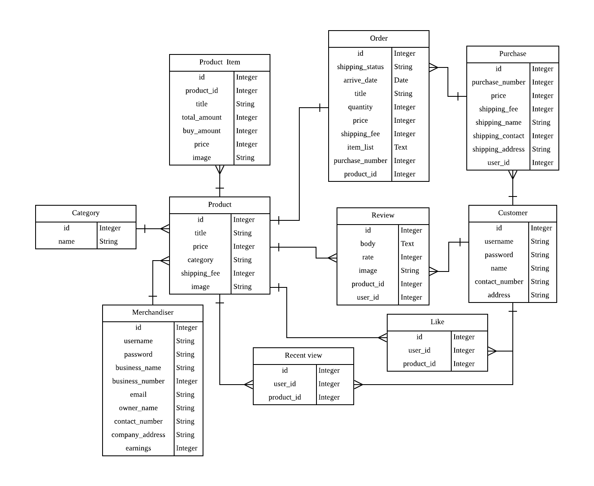

<h1 align="center">Welcome to Qmon 👋</h1>

This app is an online shopping mall app which orients a quick shipment.<br />
It designed by E-R diagram for back-end, and UI workflow for front-end.

### E-R diagram


### User Interface workflow design
- (reserved)

## Function description

## Built With
- Ruby 2.6.3
- Rails 6.0
- PostgreSQL 10.10
- Devise 4.7.1
- Bootstrap 4.0
- Sass 3.7
- Rspec 3.9
- [Acts as votable](https://github.com/ryanto/acts_as_votable/)
- [Faker](https://github.com/faker-ruby/faker)

## Demo

#### default account:
 - id: example-0@example.com
 - password: foobar

## Getting started

> Clone the repository to your local machine

```
$ git clone https://github.com/shjang7/qmon.git
```

> Change directory into the directory

```
$ cd qmon
```

> Create database

```
$ rails db:create
```

> Install dependencies:

```
$ bundle install
```

> Migrate database

```
$ rails db:migrate
```

> Test rails code

```
$ rspec --format documentation
```

> Seed sample data

```
$ rails db:seed
```

> Open server

```
$ rails server
```

> Go to `http://localhost:3001` using your browser.

## Author

👤 **Suhyeon Jang**

- Github: [@shjang7](https://github.com/shjang7)
- Linkedin: [@shjang](https://www.linkedin.com/in/shjang/)
- Twitter: [@shjang12](https://twitter.com/shjang12)

## 🤝 Contributing

Contributions, issues and feature requests are welcome!<br />Feel free to check [issues page](https://github.com/shjang7/qmon/issues).

1. Fork it (https://github.com/shjang7/qmon/fork)
2. Create your working branch (git checkout -b [choose-a-name])
3. Commit your changes (git commit -am 'what this commit will fix/add')
4. Push to the branch (git push origin feature/[feature-name])
5. Create a new Pull Request

## Show your support

Give a ⭐️ if you like this project!

## 📝 License

This project is licensed under the MIT License - check the [LICENSE](./LICENSE) file for details
